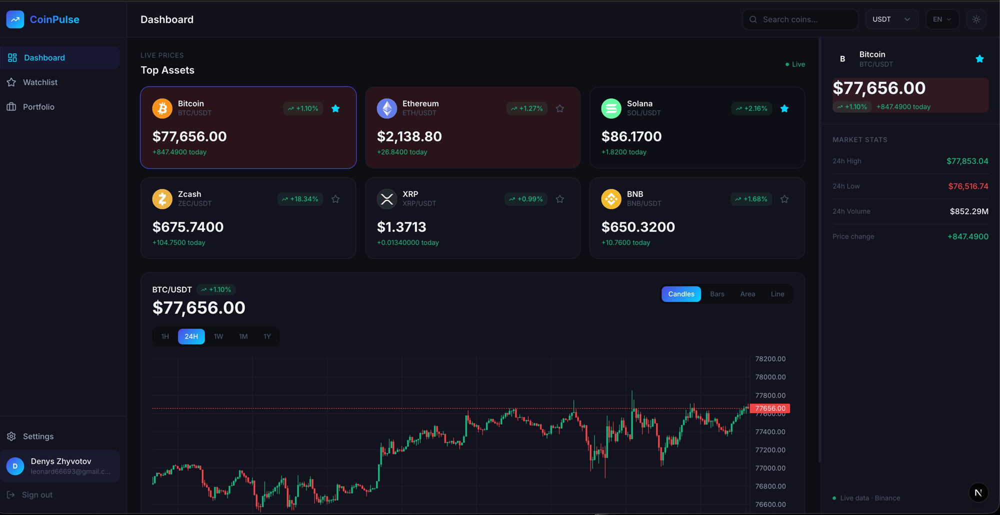
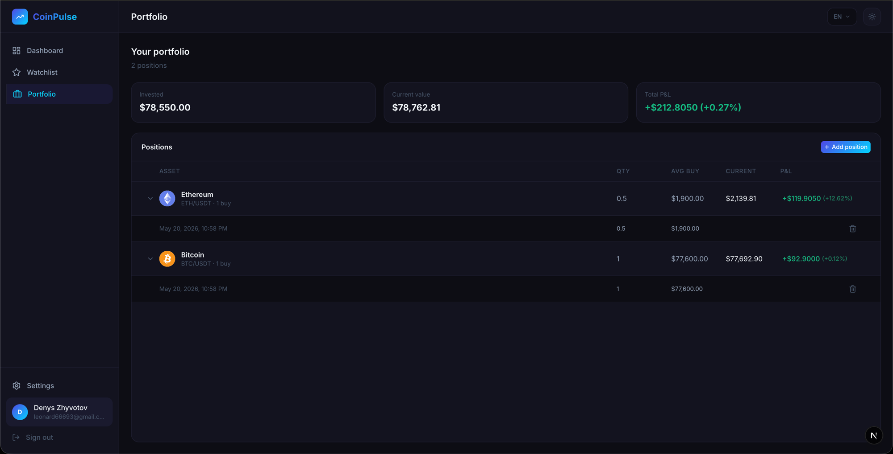

<div align="center">

# CoinPulse

**Real-time crypto dashboard. Track prices, manage your watchlist and portfolio — live.**

[](https://coin-pulse-kappa.vercel.app)


</div>





---

## What is CoinPulse?

CoinPulse is a full-stack crypto dashboard that streams live prices from Binance WebSocket API. Track your favorite coins, monitor your portfolio P&L in real time, and manage users through a role-based admin panel.

---

## Features

| Feature | Description |
|---------|-------------|
| 📈 **Live prices** | Real-time price updates via Binance WebSocket for 6+ coins |
| 🕯️ **Charts** | TradingView Lightweight Charts — Candlestick, Bar, Area, Line with 1H/24H/1W/1M/1Y ranges |
| ⭐ **Watchlist** | Add/remove coins, track live prices across your personal list |
| 💼 **Portfolio** | Track positions with buy price, quantity and real-time P&L |
| 🔐 **Auth** | Email/password + Google OAuth, JWT sessions (7 days) |
| 👥 **Roles** | superadmin / admin / developer / user with permission matrix |
| ⚙️ **Admin panel** | User management, role assignment, delete users |
| 👤 **Profile** | Edit name, email, change password (Google users get read-only profile + "managed by Google" notice) |
| 🌗 **Dark / Light theme** | Persisted theme switcher |
| 🌐 **i18n** | English + Ukrainian (cookie-based locale, next-intl 4) |
| 🔍 **Search** | Live coin search with price dropdown |
| 📱 **Responsive** | Sidebar collapses to icons on mobile, expandable search |

---

## Stack

| Layer | Technology |
|-------|-----------|
| Framework | Next.js 16 (App Router, Turbopack) |
| Language | TypeScript (strict) |
| Styling | Tailwind CSS v4 |
| Charts | TradingView Lightweight Charts v5 |
| Real-time | Binance WebSocket API (singleton, ref-counted, auto-reconnect) |
| State | Zustand (client) + TanStack Query (server cache) |
| Toasts | sonner |
| Auth | NextAuth v4 — JWT, Credentials + Google OAuth |
| i18n | next-intl 4 (EN/UK, cookie-based, no `[locale]` URL segment) |
| Database | MongoDB Atlas + Mongoose |
| Tests | Vitest 4 (node env by default; jsdom opt-in per file) |
| Deploy | Vercel |

---

## Architecture

Feature-Sliced Design (FSD) — layers import strictly downward:

```
app/ → widgets/ → features/ → entities/ → shared/
```

```
app/          Next.js routing, layouts, API routes
              _providers/   SessionProvider, QueryProvider (app-shell)
widgets/      Sidebar, Header, CandlestickChart, MarketOverview, WatchlistTable,
              PortfolioTable, CoinDetailsPanel, AdminUsersTable
features/     add-to-watchlist, remove-from-watchlist, add-to-portfolio,
              remove-from-portfolio, admin-manage-users, search-coin, select-quote,
              filter-watchlist-by-quote, coin-combobox, edit-profile, change-password
entities/     coin/{ui/{price-card, selected-symbol-stream}, types},
              watchlist/{api.ts, model/watchlist-item, ui/{watchlist-initializer,
                         watchlist-provider}, types, serializers, index},
              portfolio/{api.ts, model/portfolio-position, types, serializers, index},
              user/{lib/{auth, require-user, require-api-user}, model/user,
                    ui/current-user-role-badge, types}
shared/       ui (generic primitives only — Button, SearchInput, Select, Skeleton, …),
              lib (cn, formatters, db, parse-quote, api-fetch with 401/403 toasts, symbol),
              hooks (useTheme, useCoinMeta, useQuoteCurrencies,
                     useFormState, useFloatingRect, useResizeObserver, useStaleAfter,
                     useCoinFilter, useDismiss),
              config (routes), store (useSelectionStore only — entity data lives
                 in per-entity stores), types (roles, coin-asset, next-auth.d.ts), api
scripts/      Prebuild snapshots (Binance trading pairs)
```

### Data flow

- **Streaming prices**: Binance WS → `entities/coin/api/price-stream.ts` (ref-counted singleton with auto-reconnect on `onclose`) → `usePricesStore` (`entities/coin/model/store.ts`) → components (via `usePriceStream` hook re-exported from `@/entities/coin`).
- **Client state**: per-entity Zustand stores — `usePricesStore` (coin), `useWatchlistStore`, `usePortfolioStore`, plus `useSelectionStore` (selectedSymbol/selectedQuote) in `shared/store/`. No combined `useAppStore`.
- **Server data**: TanStack Query is the single source of truth (e.g. `useCoinMeta(quote)` for coin names + tradeable pairs). Multiple consumers share one fetch via queryKey dedup.
- **Mutations**: entity-scoped API functions in `entities/<X>/api.ts` throw on `!res.ok`; hooks compose them via `useMutation` + sonner toasts. The `apiFetch` wrapper handles 401 (signOut) and 403 (toast) globally.

### Build-time data

`scripts/generate-binance-pairs.mjs` runs as `prebuild` and snapshots Binance's `symbol → quoteAsset` map (~1400 trading pairs) into `src/shared/api/binance/pairs.generated.json`. The runtime imports the JSON directly — no 22MB `/exchangeInfo` fetch on every `/api/top-coins` or `/api/quote-currencies` hit (Next 16 data cache rejects items > 2MB and would re-download on each revalidation). Snapshot is committed; refreshed on every deploy. Falls back to the existing snapshot if the upstream fetch fails.

---

## Getting Started

### Prerequisites

- Node.js 20+
- MongoDB Atlas cluster
- Google Cloud OAuth credentials (optional)

### 1. Clone & install

```bash
git clone https://github.com/FishManHell/coin_pulse.git
cd coin_pulse
npm install
```

### 2. Configure environment

```bash
cp .env.local.example .env.local
```

```env
# MongoDB Atlas
MONGODB_URI=mongodb+srv://<user>:<password>@cluster.mongodb.net/coinpulse

# NextAuth
NEXTAUTH_SECRET=        # openssl rand -base64 32
NEXTAUTH_URL=http://localhost:3000

# Google OAuth (optional)
GOOGLE_CLIENT_ID=
GOOGLE_CLIENT_SECRET=
```

### 3. Run

```bash
npm run dev
```

Open [http://localhost:3000](http://localhost:3000)

### 4. Tests

```bash
npm test            # single run
npm run test:watch  # TDD watch mode
```

128 tests across 23 files: pure-logic units (Tier 1), Zustand stores (Tier 2), React hooks via `renderHook` + fake timers (Tier 3), plus business logic extracted from forms / smart containers / API routes (Tier 4-6: `deriveEffectiveSymbol`, `compute*Pnl`, `parsePortfolioPayload`, `ROLE_PERMISSIONS`, `translateGlobal`). `vitest run` is wired into `prebuild` — Vercel + CI fail on red tests. See `.claude/skills/coin-pulse/references/testing.md` for the pure-extract strategy and explicit skip list.

---

## API Routes

```
POST   /api/auth/register           Register with email/password
GET    /api/auth/[...nextauth]      NextAuth handler

GET    /api/watchlist               Get user watchlist (quote backfilled on read)
POST   /api/watchlist               Add coin to watchlist (accepts quote)
DELETE /api/watchlist/[symbol]      Remove coin from watchlist

GET    /api/portfolio               Get portfolio positions (quote backfilled on read)
POST   /api/portfolio               Add position (validates symbol/quote against tradingPairs)
DELETE /api/portfolio/[id]          Remove position

GET    /api/coin-meta?quote=USDT    Tradeable pairs + CoinGecko names for the given quote
GET    /api/quote-currencies        Stablecoin quote currencies discovered at build time
GET    /api/top-coins?quote=USDT    Top tradeable bases by quote volume

PATCH  /api/profile                 Update own profile / change password
                                    (rejects name/email/password updates for Google-only users —
                                     no password on file)

GET    /api/admin/users             List all users (admin+)
PATCH  /api/admin/users/[id]        Update user role/name/email (admin+)
DELETE /api/admin/users/[id]        Delete user (superadmin only)
```

### Multi-quote support

Watchlist and portfolio entries store the pair quote (`USDT`, `USDC`, …) explicitly. Old entries created before the migration have `quote: undefined` in the DB and are backfilled on read via `parseQuoteFromSymbol`. The portfolio `POST` validates that `tradingPairs.get(symbol) === quote`, so the API rejects a pair the upstream Binance snapshot doesn't list.

---

## Role Permissions

| Action | superadmin | admin | developer | user |
|--------|:---:|:---:|:---:|:---:|
| Settings page | ✅ | ✅ | ❌ | ❌ |
| View users | ✅ | ✅ | ❌ | ❌ |
| Change roles | ✅ | ✅* | ❌ | ❌ |
| Change other's password | ✅ | ❌ | ❌ | ❌ |
| Delete users | ✅ | ❌ | ❌ | ❌ |
| Dashboard / Watchlist / Portfolio | ✅ | ✅ | ✅ | ✅ |

*admin cannot assign superadmin role

---

## License

MIT
